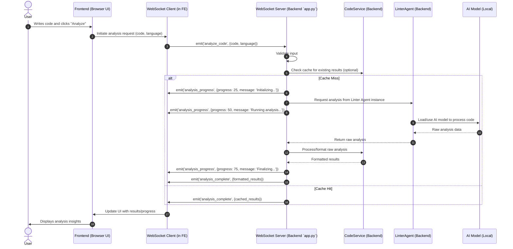

# 3. Architecture Deep Dive: The Blueprint of CogniCode Agent

Welcome to the engine room! Or, perhaps more accurately, the architect's studio. In this section, we'll lovingly dissect the architecture of CogniCode Agent, layer by layer. Understanding its structure isn't just for academic kicks; it's key to appreciating its capabilities, contributing effectively, or even just satisfying that innate developer curiosity about "how the heck does this thing work?!" We'll use diagrams, plain-English explanations, and maybe an analogy or two to make this journey as enlightening as finding an elegant solution to a gnarly bug.

## 🗺️ High-Level Overview: The 30,000 Foot View (Don't Worry, We Have Parachutes)

At its very core, CogniCode Agent is a beautifully choreographed dance between two main performers:

1.  **Frontend (Client-Side):** A sleek, responsive Next.js application that lives in your browser. This is your command center, your cockpit, your mission control. It's where you input your precious code, tweak settings, and gaze upon the rich, insightful analysis results. Think of it as the stylish dashboard of a very smart car.
2.  **Backend (Server-Side):** A powerful Python Flask application that runs locally on your machine – no cloud servers involved for core processing! This is the brain of the operation, the powerhouse housing our specialized AI agents, managing the AI models, and performing the actual, intensive code analysis.

These two components are not isolated islands; they're in constant, chattering communication, primarily via **WebSockets (Socket.IO)**. This technology enables real-time, bidirectional interaction, allowing the frontend to instantly send your code to the backend for analysis and for the backend to stream results back dynamically, all without those clunky old page reloads. It's like a direct, open line between your dashboard and the engine.

**Analogy Time! (Because who doesn't love a good analogy?)**
Imagine CogniCode Agent as a high-tech, bespoke tailor shop for your code:
*   **You (The Developer):** The discerning client, bringing in your fabric (your code).
*   **Frontend:** The elegant showroom and consultation area. You present your fabric, discuss your needs (analysis types), and later view the perfectly tailored suggestions on a digital mannequin.
*   **Backend:** The bustling workshop in the back, filled with specialized master tailors (our AI Agents), each an expert in a different area – one for spotting fabric flaws (linting), one for suggesting structural improvements (refactoring), and one for drafting perfect patterns for accessories (test generation).
*   **WebSockets:** An invisible, super-fast conveyor belt, whisking your fabric to the workshop and returning the refined designs and suggestions to the showroom in moments.
*   **AI Models:** The unique, high-precision tools and encyclopedic knowledge books each master tailor uses – their secret sauce for crafting excellence.

```mermaid
graph LR
    User[👨‍💻 Developer] --> FE[🌐 Frontend: Next.js App];
    FE <-- ⚡ Real-time via WebSocket (Socket.IO) ⚡ --> BE[🧠 Backend: Python Flask App];
    BE -- Orchestrates & Utilizes --> Agents[🤖 Multi-Agent AI System];
    Agents -- Leverage --> AIModels[📚 Local AI Models];

    subgraph Browser Window (Your View)
        FE
    end

    subgraph Your Local Machine (The Magic Happens Here)
        BE
        Agents
        AIModels
    end

    style User fill:#FAD7A0,stroke:#E67E22
    style FE fill:#D6EAF8,stroke:#3498DB,stroke-width:2px
    style BE fill:#D5F5E3,stroke:#2ECC71,stroke-width:2px
    style Agents fill:#FCF3CF,stroke:#F1C40F,stroke-width:2px
    style AIModels fill:#FDEDEC,stroke:#E74C3C,stroke-width:2px
```
This diagram provides a bird's-eye view. Now, let's zoom in on each performer.

## 🖥️ Frontend Architecture: The User's Cockpit – Sleek, Smart, and Speedy

The frontend is your window into CogniCode Agent's soul. It's meticulously crafted using a modern tech stack to be both visually appealing and highly functional. Our goal? To make interacting with complex AI analysis feel intuitive and, dare we say, enjoyable!

### Key Components & Technologies: The Building Blocks of Brilliance
*   **Next.js (with App Router):** We chose Next.js for its robust framework capabilities, including server-side rendering (though we lean client-side for this app), optimized builds, and a fantastic developer experience. The App Router allows for a modern, flexible routing paradigm.
*   **React & TypeScript:** The dynamic duo! React for building interactive, component-based UIs, and TypeScript for bringing static typing into the JavaScript world. This means fewer runtime errors and a more maintainable codebase. Think of TypeScript as the grammar checker for our JavaScript, keeping things neat and tidy.
*   **Tailwind CSS & shadcn/ui:** For styling, we embrace the utility-first approach of Tailwind CSS, allowing for rapid UI development without writing custom CSS for every little thing. Layered on top, `shadcn/ui` provides a set of beautifully designed, accessible, and customizable components that we can easily integrate. It's like having a professional designer and a UI kit rolled into one.
*   **Monaco Editor:** This is the heart of the code input experience. It's the same editor that powers VS Code, so it comes packed with features like syntax highlighting for numerous languages, IntelliSense (autocompletion), and a familiar feel for most developers.
*   **Socket.IO Client:** The frontend's lifeline to the backend. This library handles the complexities of WebSocket communication, making real-time updates a breeze.
*   **State Management (Primarily React Context & Hooks):** For managing application-wide state (like the current theme, socket connection status, or analysis results), we leverage React's built-in Context API and custom hooks. This keeps our state logic organized and avoids prop-drilling nightmares. For more complex local component state, standard React hooks like `useState` and `useReducer` are employed.

### Directory Structure Highlights (Frontend): Where the Good Stuff Lives
A well-organized frontend is a happy frontend. Here’s a peek into our main folders:
*   `app/`: This is where the Next.js App Router magic happens. You'll find our main page layouts (like `layout.tsx`) and the primary page component (`page.tsx`) that structures the entire application view.
*   `components/`: Home to all our reusable React components. This includes:
    *   `ui/`: Contains components provided by `shadcn/ui` (e.g., Button, Card, Tabs), giving us polished UI primitives.
    *   Application-specific components: Custom-built elements like `code-editor.tsx`, `analysis-panel.tsx`, `refactor-panel.tsx`, and `testgen-panel.tsx` which are tailored to CogniCode Agent's unique needs.
*   `hooks/`: This is where our custom React Hooks take center stage. Hooks like `use-socket.ts` (and its variations) encapsulate complex logic, especially for managing WebSocket connections and state.
*   `lib/`: A collection of utility functions (`utils.ts`) – think of these as our frontend's Swiss Army knife for common tasks like data formatting or helper logic.
*   `types/`: In the TypeScript world, types are king! This folder (`types/analysis.ts`, etc.) houses our custom type definitions, ensuring that the data flowing through our application (especially data exchanged with the backend) has a clear and predictable structure.

### Visualizing the Frontend: Component Hierarchy
Let's sketch out how some of these components might fit together:

```mermaid
graph TD
    A[AppLayout (`app/layout.tsx`)] --> H[Header (`components/header.tsx`)];
    A --> M[MainPage (`app/page.tsx`)];
    A --> F[Footer (Conceptual)];

    H --> L[Logo];
    H --> LS[LanguageSelector];
    H --> TT[ThemeToggle (`components/theme-provider.tsx`)];

    M --> CP[CodeInputPanel];
    M --> RP[ResultsDisplayPanel];

    CP --> CE[CodeEditor (`components/code-editor.tsx`)];
    CP --> ActB[ActionButtons (Analyze, etc.)];

    RP --> Tabs[Tabs (`components/ui/tabs.tsx`)];
    Tabs --> AnP[AnalysisPanelTab (`components/analysis-panel.tsx`)];
    Tabs --> RfP[RefactorPanelTab (`components/refactor-panel.tsx`)];
    Tabs --> TsP[TestGenPanelTab (`components/testgen-panel.tsx`)];

    style A fill:#D6EAF8,stroke:#3498DB
    style M fill:#E8DAEF,stroke:#8E44AD
    style CP fill:#A9DFBF,stroke:#27AE60
    style RP fill:#A9DFBF,stroke:#27AE60
    style CE fill:#F9E79F,stroke:#F39C12
```
*(This is a simplified representation; the actual component tree will be explored in the Codebase Explorer.)*

This frontend architecture is designed to be modular, maintainable, and provide a delightful user experience. Now, let's venture into the backend...

## ⚙️ Backend Architecture: The Intelligence Core – Where Python Meets AI

If the frontend is the slick dashboard, the backend is the powerful, meticulously tuned engine humming under the hood. It's written in Python, leveraging the Flask microframework for its web server capabilities and Flask-SocketIO for that critical real-time communication link with the frontend. This is where your code gets analyzed, suggestions are born, and tests are drafted – all locally and privately.

### Key Components & Technologies: The Backend's Arsenal
*   **Flask:** Our choice for a lightweight and flexible web framework. Flask doesn't impose too much structure, allowing us to build what we need without unnecessary overhead. It's perfect for creating API endpoints and managing WebSocket events.
*   **Flask-SocketIO:** Extends Flask to handle Socket.IO messages, enabling the real-time, event-driven communication crucial for sending analysis progress and results back to the frontend.
*   **Python:** The lingua franca of AI and data science, making it a natural choice for our backend where AI models are the stars. Its extensive libraries and readability are big wins.
*   **AI Agents (Linter, Refactor, TestGen):** These are specialized Python classes, the real workhorses. Each agent is an expert in its domain, using specific AI models to perform its tasks. We'll dive deeper into these in the "Multi-Agent System" section.
*   **Transformers & PyTorch:** These are the foundational libraries from the AI world. Hugging Face's Transformers library provides easy access to thousands of pre-trained models (like the CodeBERT and CodeT5 we use), while PyTorch is a powerful tensor computation library often used for deep learning model training and inference.
*   **AgentPool (`server/app.py`):** A custom-built class to manage the lifecycle and concurrent use of our AI agents. Since loading AI models can be resource-intensive, the AgentPool helps us use them efficiently, potentially reusing initialized agent instances. Think of it as a smart dispatcher for our AI experts.
*   **CodeService (`server/services/code_service.py`):** This acts as a business logic layer, sitting between the Flask request handlers (for API/SocketIO) and the AI agents. It might handle tasks like pre-processing code before sending it to an agent, post-processing results, or managing a cache to speed up responses for previously seen code.

### Directory Structure Highlights (Backend - within `server/`): The Engine Room's Layout
The `server/` directory is where all backend Python code resides.
*   `app.py`: The heart of the Flask application. This file initializes the Flask app, sets up SocketIO, defines API routes (like `/health`), and handles incoming WebSocket events (e.g., `analyze_code`, `generate_tests`). It also orchestrates the `AgentPool`.
*   `agents/`: This directory contains the intelligence.
    *   `base_agent.py`: An abstract base class defining the common interface and perhaps some shared functionality for all our AI agents (like model loading logic).
    *   `linter_agent.py`, `refactor_agent.py`, `testgen_agent.py`: Concrete implementations of our specialized agents. Each will house the logic specific to its task.
*   `services/`: Home to modules like `code_service.py`, which encapsulate business logic related to code processing, interacting with agents, and potentially caching.
*   `utils/`: A place for utility modules, such_as `logger.py` for setting up structured logging across the backend.
*   `scripts/`: Contains helper scripts, most notably `download_models.py`, which fetches the AI models from their repositories.
*   `models/` (Implicit, not version-controlled): While not in Git, this is the default directory (configurable via `MODELS_PATH` env var) where the `download_models.py` script stores the downloaded AI models.

### Visualizing the Backend: A Simplified Request Lifecycle
Here's a conceptual flow for a typical analysis request:

```mermaid
graph TD
    subgraph Frontend (Browser)
        UserInput[User inputs code, clicks Analyze] --> SocketEmit[Socket.IO Emit: 'analyze_code'];
    end

    SocketEmit -- WebSocket --> FlaskSocketIO[Flask-SocketIO Handler in `app.py`];

    subgraph Backend (Local Server)
        FlaskSocketIO --> AgentPool[AgentPool: Get LinterAgent];
        AgentPool --> LinterAgent[LinterAgent Instance];
        LinterAgent --> AIModel[AI Model (e.g., CodeBERT): Process Code];
        AIModel -- Raw Results --> LinterAgent;
        LinterAgent --> CodeService[CodeService: Process/Format Results];
        CodeService -- Processed Results --> FlaskSocketIO;
    end

    FlaskSocketIO -- WebSocket --> SocketReceive[Socket.IO Receive: 'analysis_complete'];

    subgraph Frontend (Browser)
        SocketReceive --> DisplayResults[UI updates with analysis];
    end

    style UserInput fill:#FAD7A0,stroke:#E67E22
    style SocketEmit fill:#AED6F1,stroke:#3498DB
    style FlaskSocketIO fill:#A9DFBF,stroke:#2ECC71
    style AgentPool fill:#F9E79F,stroke:#F39C12
    style LinterAgent fill:#F9E79F,stroke:#F39C12
    style AIModel fill:#FDEDEC,stroke:#E74C3C
    style CodeService fill:#E8DAEF,stroke:#8E44AD
    style SocketReceive fill:#AED6F1,stroke:#3498DB
    style DisplayResults fill:#FAD7A0,stroke:#E67E22
```

## 🤖 The Multi-Agent System: A Symphony of Specialized AI Workers

At the heart of CogniCode Agent's intelligence lies its multi-agent system. Instead of a monolithic AI trying to do everything, we employ a team of specialized agents, each an expert in its own domain. This approach offers several advantages:

*   **Modularity:** Each agent can be developed, updated, and optimized independently.
*   **Clarity of Purpose:** Each agent has a well-defined responsibility.
*   **Flexibility:** We can easily add new agents for new types of analysis in the future.
*   **Resource Optimization:** We can load only the necessary models for the requested task.

Think of it like an elite task force:

*   **The Linter Agent (Code Detective "Sherlock"):** This agent is your meticulous code investigator. Armed with models like CodeBERT and a keen eye for detail (think rule engines and security pattern databases), Sherlock sniffs out syntax errors, potential runtime bugs, style violations, and even some common security vulnerabilities. Its mission: to ensure your code is clean, correct, and robust.
*   **The Refactor Agent (Code Sculptor "Michelangelo"):** This agent sees the beautiful, optimized code hidden within your existing logic. Using generative models like CodeT5, Michelangelo suggests improvements for performance (e.g., more efficient algorithms), readability (e.g., clearer variable names, better structure), and modernization (e.g., updating to the latest language features). Its goal: to help you transform good code into great code.
*   **The TestGen Agent (Diligent Scribe "Bartleby"):** While perhaps not preferring *not* to, this agent diligently drafts unit tests. It analyzes your functions and methods, tries to understand their purpose, and generates test cases, including stubs for edge conditions. Bartleby's aim: to take the tedium out of test writing and help you achieve better coverage.

These agents are managed by the `AgentPool` in `app.py`, which ensures they are ready when needed and that their resources (especially the memory-hungry AI models) are handled efficiently.

## 🌊 Data Flow & Communication: The Information Superhighway (Now with More Lanes!)

Understanding how data flows is crucial. Let's trace the journey of your code when you hit that "Analyze" button, now with a bit more detail on the WebSocket events for progress.



**Key Takeaways from the Data Flow:**
*   **Client-Initiated:** The process starts with a user action on the frontend.
*   **WebSocket is Key:** Socket.IO handles the message passing.
*   **Backend Orchestration:** `app.py` receives the request and delegates to the appropriate agent (via the `AgentPool`) and service (`CodeService`).
*   **Progress Updates:** The backend can send intermediate progress messages, making the experience feel more responsive for potentially long-running analyses.
*   **Local AI:** The AI model interaction happens entirely within the backend on the user's machine.
*   **Formatted Results:** The `CodeService` plays a role in ensuring the data sent back to the frontend is in a clean, usable format.

## 🧩 Design Patterns & Rationale: The "Why" Behind the "How" – Our Architectural Choices

Good software architecture isn't just about making things work; it's about making them work well, being maintainable, and being ready for the future. Here are some of the key design patterns and principles that guided our choices for CogniCode Agent:

*   **Multi-Agent Architecture (Backend):**
    *   **Pattern:** Similar to the Strategy pattern or a collection of specialized services.
    *   **Rationale:**
        *   *Separation of Concerns:* Each agent focuses on one specific task (linting, refactoring, test generation). This makes the codebase for each agent simpler and easier to manage.
        *   *Extensibility:* Adding new analysis capabilities becomes a matter of creating a new agent class that conforms to a base interface, rather than modifying a monolithic analysis engine. Want to add documentation generation? New agent! Security deep scan? New agent!
        *   *Resource Management:* Different agents might use different AI models. This allows us to load only the necessary models for a given task, optimizing memory usage.
*   **Service Layer (Backend - `CodeService`):**
    *   **Pattern:** Service Layer.
    *   **Rationale:** Decouples the web request handlers (in `app.py`) from the core business logic and agent interactions. `app.py` worries about HTTP/WebSocket communication, while `CodeService` worries about orchestrating analysis, processing results, and caching. This improves testability and maintainability.
*   **Agent Pool (Backend - `AgentPool` in `app.py`):**
    *   **Pattern:** Object Pool.
    *   **Rationale:** AI models can be large and take time to initialize. The Agent Pool aims to manage instances of agents (and thus their models) to reduce latency for subsequent requests and control resource consumption. It might pre-initialize some agents or keep recently used ones warm.
*   **Observer Pattern (Implicit with Socket.IO):**
    *   **Pattern:** Observer.
    *   **Rationale:** The frontend UI components (observers) effectively subscribe to events (analysis results, progress updates) emitted by the backend Socket.IO server (the subject). This enables the real-time, reactive nature of the UI.
*   **Provider Pattern (Frontend - React Context API):**
    *   **Pattern:** Provider / Dependency Injection (for state).
    *   **Rationale:** For global state like theme settings, WebSocket connection status, or potentially shared analysis results, React's Context API provides a way to pass data through the component tree without having to pass props down manually at every level (prop drilling). This simplifies component interfaces and makes state management cleaner.
*   **Utility/Helper Modules (Frontend `lib/` & Backend `utils/`):**
    *   **Principle:** Don't Repeat Yourself (DRY).
    *   **Rationale:** Common functions (e.g., data formatting, string manipulation, logging setup) are extracted into reusable modules. This keeps the main application logic cleaner and promotes code reuse.
*   **Configuration Management (Environment Variables & `AppConfig`):**
    *   **Principle:** Separate configuration from code.
    *   **Rationale:** Allows for different settings in different environments (development, testing, hypothetical production) without code changes. `AppConfig` in `server/app.py` centralizes backend configuration access.

These choices reflect our commitment to building a system that is not only powerful but also robust, maintainable, and ready to evolve.

## 📁 Directory Structure Explained: Navigating the Project – Your GPS for the Codebase

A well-organized project is like a well-labeled map – it helps you find what you're looking for quickly and understand the lay of the land. Here’s a guided tour of the CogniCode Agent directory structure:

```
cognicode-agent/
├── app/                          # 🎨 Next.js App Router: Core frontend pages and layouts
│   ├── layout.tsx                # Root layout for all pages (e.g., nav, footer, providers)
│   ├── page.tsx                  # Main application page component (the dashboard)
│   └── globals.css               # Global styles, Tailwind CSS base directives
│
├── components/                   # 🧩 React Components (Frontend)
│   ├── ui/                       # Pre-styled UI primitives from shadcn/ui (buttons, cards, etc.)
│   ├── analysis-panel.tsx        # Component to display analysis results
│   ├── code-editor.tsx           # Monaco editor integration
│   ├── header.tsx                # Application header component
│   ├── refactor-panel.tsx        # Component for refactoring suggestions
│   ├── testgen-panel.tsx         # Component for generated tests
│   └── theme-provider.tsx        # Manages light/dark theme
│
├── docs/                         # 📚 Existing Project Documentation (User guides, etc.)
│   └── ...                       # (Many subdirectories and files)
│
├── docs_new/                     # 📖 This New, Ultra-Detailed Documentation You Are Reading!
│   ├── README.md                 # Entry point for this new documentation
│   ├── introduction.md           # Project vision and purpose
│   ├── getting-started.md        # Setup and first run guide
│   ├── architecture.md           # This file! Blueprint of the system
│   ├── codebase-explorer/        # Deep dives into specific code sections
│   │   ├── frontend/             # Frontend specific code walkthroughs
│   │   └── backend/              # Backend specific code walkthroughs
│   ├── features.md               # Detailed feature explanations
│   ├── configuration.md          # How to configure the agent
│   ├── testing.md                # Testing strategies
│   ├── deployment.md             # Deployment guidelines
│   ├── contributing.md           # How to contribute
│   ├── faq-glossary.md           # FAQs and glossary
│   └── changelog.md              # Project version history
│
├── hooks/                        # 🎣 Custom React Hooks (Frontend)
│   ├── use-socket.ts             # Core hook for WebSocket communication
│   └── use-toast.ts              # Hook for displaying notifications
│
├── lib/                          # 🛠️ Utility Functions (Frontend)
│   └── utils.ts                  # General helper functions for the frontend
│
├── server/                       # 🧠 Backend Python/Flask Application
│   ├── agents/                   # AI Agent implementations
│   │   ├── base_agent.py         # Abstract base class for agents
│   │   ├── linter_agent.py       # Agent for code linting and analysis
│   │   ├── refactor_agent.py     # Agent for code refactoring
│   │   └── testgen_agent.py      # Agent for test generation
│   ├── scripts/                  # Utility scripts for the backend
│   │   └── download_models.py    # Script to download AI models
│   ├── services/                 # Backend business logic services
│   │   └── code_service.py       # Service for code processing, caching, etc.
│   ├── utils/                    # Utility modules for the backend
│   │   └── logger.py             # Logging setup
│   ├── app.py                    # Main Flask application file (entry point for backend)
│   ├── Dockerfile                # Dockerfile for containerizing the backend
│   ├── requirements.txt          # Python dependencies for the backend
│   └── .env.example              # Example environment variables for backend (you'd create .env)
│
├── types/                        # 🏷️ TypeScript Type Definitions (Frontend)
│   └── analysis.ts               # Example type definitions for analysis data structures
│
├── .env.local.example            # Example environment variables for frontend (you'd create .env.local)
├── .gitignore                    # Specifies intentionally untracked files that Git should ignore
├── components.json               # Configuration for shadcn/ui components
├── Dockerfile.frontend           # Dockerfile for containerizing the frontend
├── docker-compose.yml            # Docker Compose file to run multi-container applications
├── jest.config.js                # Jest testing framework configuration (frontend)
├── LICENSE                       # Project's software license (MIT)
├── next.config.js                # Next.js configuration file
├── package.json                  # Frontend project manifest (dependencies, scripts)
├── postcss.config.js             # PostCSS configuration (used by Tailwind CSS)
├── README.md                     # Main project README (overview, quick start)
├── setup.sh                      # Automated setup script for easy installation
├── start-dev.sh                  # Script to start both frontend & backend for development
├── tailwind.config.ts            # Tailwind CSS configuration
└── tsconfig.json                 # TypeScript compiler configuration (frontend)
```

This map should help you navigate the codebase with confidence. Each directory and key file has a clear purpose, contributing to the overall functionality of CogniCode Agent.

---
Next: [The Codebase Explorer (Frontend Overview)](codebase-explorer/frontend/README.md)
